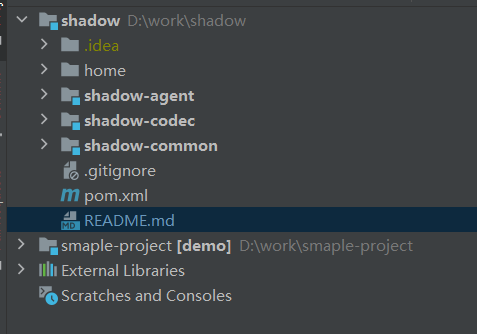

# shadow

shadow

# 快速开始
    
    打包: mvn clean package, 会在项目home目录下生成shadow-agent.jar、config、lib等依赖。

    启动方式:  -javaagent:/shadow-agent/home/shadow-agent.jar.
    
    本地调试:
           1、普通调试项目(如web、soa服务等)和shadow作为同一级别模块打开
           2、调试项目添加 VM 参数到启动类 -javaagent:D:\work\shadow\home\shadow-agent.jar，就可以debug了.
    如下图:
        
# 项目简介

    

